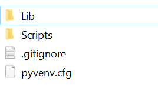
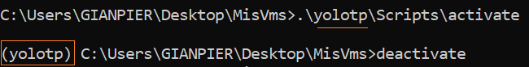
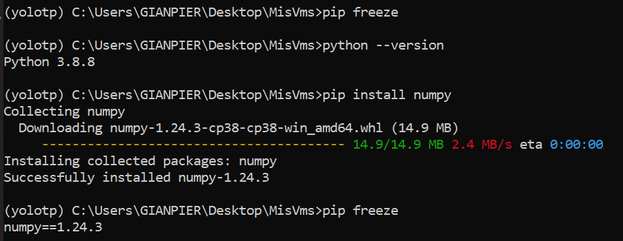

## Entornos Virtuales

Para administrar estos espacios, tenemos dos opciones.
- **Anaconda** : Puedes elegir la version de python que desees.
- **Virtual Env** : La version de python sera la misma que la instalada (base)


### ANACONDA

Si necesitas desplegar un entorno con alguna version de python especifica te sugiero usar Anaconda

El entorno virtual se crea en la ruta donde esta anaconda.

> Mi Compu: En mi caso uso por defecto el entorno (base) de conda, como mi python local. Entonces cualquier pip install que haga se guardara en como dependencia de la *env* (base)


Aqui estan todos los comandos [Link](https://www.campusmvp.es/recursos/post/como-gestionar-diferentes-entornos-para-python-con-conda.aspx) 
\
\
\
**Instalar Anaconda**

Lo mas importante es que lo instales para todos los usuarios que sea en la carpeta C:/ no en la C:/Users/Name_user

Basicamente es mas facil que tus cosas esten directamente en C:/ te ayuda un poco con el path

Una vez instalado el anaconda -> Ahora tenemos python tambien pero si quiero tenerlo en el **PATH**

Tratar de poner en el orden de las variables de entorno lo mas arriba posible, si no algo rompe

- C:\Users\GIANPIER\anaconda3
- C:\Users\GIANPIER\anaconda3\Scripts
- C:\Users\GIANPIER\anaconda3\Library\bin


### Virtual Env

Para trabajar con entornos virtuales debemos descargar la siguiente dependencia
````sh
pip install virtualenv
````

Veras todas las dependencias que instalaste en tu compu
````sh
pip freeze
````


#### Crear el entorno virtual

OJO: Este entorno tendra la misma version de python que tiene la compu(osea la base)

En una carpeta vacia, le doy un nombre al entorno ej:  `mi_vm` , esto me crea el entorno
````
virtualenv mi_vm
````

Se creara la carpeta `mi_vm` con los siguientes archivos




##### Activar el entorno virtuale

En la misma ruta donde esta la carpeta `mi_vm` (no dentro de esta) tipear
````
.\mi_vm\Scripts\activate
````

Ej de un entorno llamada `yolotp`




Ahora estas por el cmd en un entorno nuevo, juega con la consola para verificar que no siges en tu computadora :)




```shell
# Apagar el entorno virutal
$ deactivate
```


## Requirements

Podemos exportar todos los nombres de las dependencias que usa un entorno en una lista, especificamente en un archivo.txt con cada version de cada libreria que estemos usando. [LINK](https://note.nkmk.me/en/python-pip-install-requirements/#install-packages-with-pip-and-requirementstxt)

Esto sirve para que si alguien quiera replicar el entorno, le pasemos el archivo.txt y que con un `pip install` se descargue todo.

```shell
# Muestra los paquetes y sus versiones instaladas en el entorno actual
$ pip freeze

# Guardar la salida de `pip freeze` en un archivo.
$ pip freeze > requirements.txt

# Instala todos los paquetes del archivo txt
$ pip install -r requirements.txt
```