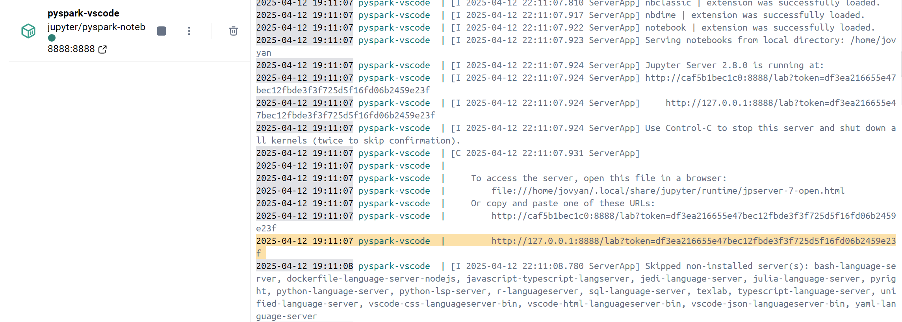

# Pyspark

## Instalacion

La opcion de usar **docker**, me soluciona muchos temas vinculados a la instalacion de spark

[Video Tutorial](https://youtu.be/HqIt0I_QQ8g?si=3sIR7Anhi0MCQQjO) de Youtube, basicamente es bajar la imagen de `jupyter/pyspark-notebook`

### Lista Pasos

```sh
# 1. Prender docker
cd project_path

# 2. Correr el archivo 'docker-compose.yaml' , el cual instalala la imagen 'jupyter/pyspark-notebook'
#    Creara un Container con el nombre de la carpeta donde esta parada el archivo 'docker-compose.yaml' 
docker-compose up -d

# 3. Darle RUN, me da acceso al bash para poder acceder a la raiz del container.
docker exec -it pyspark-vscode bash
```


## Comenzar

Una vez instalado, es decir terminado el **paso de instalacion**.

1. Prender el docker, esto es simplemente abrir el **Docker Desktop** y ver que este en **running**
2. Levantar el **container** con el comando ``docker exec -it pyspark-vscode bash`` o bien lo puedes hacer desde la interfaz grafica.
3. En los logs, se vera un msj con la URL para la connection with Jupyter: <br> `To access the server` <br>Si le das click te manda a una pagina web.




Para usarlo mediante VScode : `> Seleccionar el Kernel > Servidor de Jupyter existente > ` te va a pedir esa URL copias y pegas en el cuadrito -> ENTER y listo


### Tips

Para mostrar el contenido completo de las columnas de un Dataframe
```python
# Por defecto solo muestra una cantidad fija de ancho por columna
df.show(truncate=False)

# Por defecto solo se pueden visualizar 20 filas. Si quieres mas aumenta el numero
df.show(20, False)
```

## Lectura Archivos Pesados

Como leer archivos de texto pesados con python

Usando **generadores**, *lazy functions* para no cargar todo en memoria y asi poder leer linea por linea de archivos grandes.

```py
def leer_lineas(archivo, numero_linea):
  buffer = []
  with open(archivo, 'r', enconding = 'utf-8') as f:
    for linea in f:
        buffer.append(linea)
        if len(buffer) == numero_linea:
            yield buffer
            buffer = []
    if len(buffer) > 0:
       yield buffer


for bloque in leer_lineas('archivo.txt', 5):
    print('\n'.join(bloque))

    continuar = input('Presione Enter para continuar, "q" para salir: ')
    if continuar == 'q':
        break
```


### Parsear

Un campo String con un Schema definido

```python
from pyspark.sql.types import *
schema = StructType([ 
    StructField("Zipcode",StringType(),True), 
    StructField("ZipCodeType",StringType(),True), 
    StructField("City",StringType(),True), 
    StructField("State", StringType(), True)
  ])

#Convert json column to multiple columns
from pyspark.sql.functions import col,from_json
dfJSON = dfFromTxt.withColumn("jsonData",from_json(col("value"),schema)) \
                   .select("jsonData.*")
dfJSON.printSchema()
dfJSON.show(truncate=False)

#==================================================
root
 |-- Zipcode: string (nullable = true)
 |-- ZipCodeType: string (nullable = true)
 |-- City: string (nullable = true)
 |-- State: string (nullable = true)

+-------+-----------+-------------------+-----+
|Zipcode|ZipCodeType|City               |State|
+-------+-----------+-------------------+-----+
|704    |STANDARD   |PARC PARQUE        |PR   |
|704    |STANDARD   |PASEO COSTA DEL SUR|PR   |
|709    |STANDARD   |BDA SAN LUIS       |PR   |
|76166  |UNIQUE     |CINGULAR WIRELESS  |TX   |
|76177  |STANDARD   |FORT WORTH         |TX   |
|76177  |STANDARD   |FT WORTH           |TX   |
|704    |STANDARD   |URB EUGENE RICE    |PR   |
|85209  |STANDARD   |MESA               |AZ   |
|85210  |STANDARD   |MESA               |AZ   |
|32046  |STANDARD   |HILLIARD           |FL   |
+-------+-----------+-------------------+-----+
```


### Archivos Json

Spark SQL puede inferir automáticamente el esquema de un conjunto de datos JSON y cargarlo como un DataFrame. 

Esta conversión se puede realizar utilizando `SparkSession.read.json()` para un archivo JSON. [[Docu]](https://spark.apache.org/docs/latest/sql-data-sources-json.html)  


Tenga en cuenta que el archivo que se ofrece como archivo json no es un archivo JSON típico. Cada línea debe contener un objeto JSON válido, independiente y autónomo.

Ejemplo de como deberia verse el archivo

```json
{"ca1":'1', name:"Jorde"}   // salto de linea
{"ca1":'2', name:"Pedor"}   // salto de linea
{"ca1":'3', name:"Esteban"}  // salto de linea
...
```